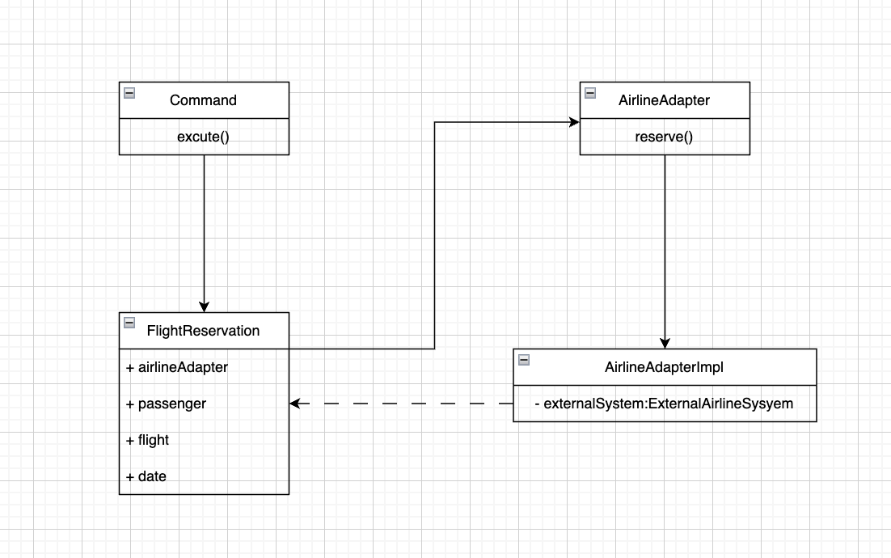

### 항공/협력 업체 예매/예약 관리 서비스

#### 패턴 선택 근거
- 구조 디자인 패턴: `어댑터 패턴`
- 선택 이유: 항공/협력 업체 예약/예약 관리 서비스를 구현할 때, 외부 항공사나 협력 업체의 예약 시스템과의 통합이 필요합니다. 그러나 외부 시스템과 서비스의 내부 구조가 호환되지 않을 수 있습니다. 어댑터 패턴을 사용하면 이러한 호환성 문제를 해결할 수 있습니다. 어댑터 클래스를 통해 외부 시스템과의 인터페이스를 서비스의 내부 구조에 맞게 변환하여 사용할 수 있습니다. 예약/예약 관리 서비스 내부에서는 일관된 인터페이스를 사용하여 외부 시스템과 통신할 수 있을 것으로 예상됩니다.

- 행위 디자인 패턴: `커맨더 패턴`
-  선택 이유: 사용자의 예약 생성 및 변경 요청을 객체로 캡슐화하고, 이를 나중에 실행하거나 취소할 수 있는 구조가 필요합니다. 커맨드 패턴을 사용하면 이러한 요청을 객체로 표현하여 관리할 수 있음으로 선택하게 되었습니다. 각각의 예약 요청은 커맨드 객체로 표현되어 예약 서비스 내부에서 실행되거나 취소될 수 있는 구조가 가능합니다. 예약 관리 서비스의 유연성을 높이고, 새로운 예약 관리 기능을 추가하거나 기존 기능을 변경할 때 코드를 수정하는 데 도움이 될 수 있을 것으로 예상하고 추가하였습니다.

#### 클래스 다이어그램



#### 파일별 모듈 코드
```java
//외부 항공사 예약 시스템과의 통합을 위한 어댑터 인터페이스
public interface AirlineAdapter { 
void reserve(String passenger, String flight, Date date); 
}
```

```java
//외부 항공사 예약 시스템과의 통합을 위한 어댑터 구현
public class AirlineAdapterImpl implements AirlineAdapter { 
	private ExternalAirlineSystem externalSystem;
	 
	public AirlineAdapterImpl(ExternalAirlineSystem externalSystem) { 
	this.externalSystem = externalSystem; 
	} 
	
	@Override 
	public void reserve(String passenger, String flight, Date date) { 
	externalSystem.book(passenger, flight, date); 
	} 
}
```

```java
// 예약 커맨드 인터페이스 정의
public interface ReservationCommand {     
	void execute(); 
	}
```

```java
// 예약 생성 커맨드
public class CreateReservationCommand implements ReservationCommand {
    private ReservationService reservationService;
    private Reservation reservation;

    public CreateReservationCommand(ReservationService reservationService, Reservation reservation) {
        this.reservationService = reservationService;
        this.reservation = reservation;
    }

    @Override
    public void execute() {
        reservationService.createReservation(reservation);
    }
}

// 예약 취소 커맨드
public class CancelReservationCommand implements ReservationCommand {
    private ReservationService reservationService;
    private String reservationId;

    public CancelReservationCommand(ReservationService reservationService, String reservationId) {
        this.reservationService = reservationService;
        this.reservationId = reservationId;
    }

    @Override
    public void execute() {
        reservationService.cancelReservation(reservationId);
    }
}

```

```java
// 예약 서비스 커맨드 실행자 : Invoker
@Component
public class ReservationServiceInvoker {
    private Queue<ReservationCommand> commandQueue = new LinkedList<>();

    // 커맨드를 큐에 추가
    public void addToQueue(ReservationCommand command) {
        commandQueue.add(command);
    }

    // 큐에서 커맨드를 꺼내 실행
    public void processCommands() {
        while (!commandQueue.isEmpty()) {
            ReservationCommand command = commandQueue.poll();
            command.execute();
        }
    }
}

```

```java
// 커맨드를 사용하여 클라이언트 예약 생성 및 취소
@Service
public class ReservationClientService {
    @Autowired
    private ReservationServiceInvoker invoker;

    @Autowired
    private ReservationService reservationService;

    public void makeReservation(Reservation reservation) {
        ReservationCommand createCommand = new CreateReservationCommand(reservationService, reservation);
        invoker.addToQueue(createCommand);
        invoker.processCommands();
    }

    public void cancelReservation(String reservationId) {
        ReservationCommand cancelCommand = new CancelReservationCommand(reservationService, reservationId);
        invoker.addToQueue(cancelCommand);
        invoker.processCommands();
    }
}
```

#### 어댑터 패턴 구조 설명
1. 타겟 인터페이스 (Target Interface):
    - `AirlineReservationAdapter` 인터페이스가 타겟 인터페이스 역할을 합니다. 이 인터페이스는 클라이언트가 사용할 예약 서비스의 메서드를 정의합니다. 여기서는 `reserveFlight` 메서드가 이에 해당합니다.
2. 어댑터 클래스 (Adapter Class):
    - `AirlineReservationAdapterImpl` 클래스가 어댑터 클래스 역할을 합니다. 이 클래스는 `AirlineReservationAdapter` 인터페이스를 구현하면서, 외부 항공사 예약 시스템과의 연동을 담당합니다.
    - 생성자를 통해 외부 시스템과의 연동을 위한 `ExternalAirlineReservationSystem` 객체를 받습니다.
3. 어댑티 (Adaptee):
    - `ExternalAirlineReservationSystem` 클래스가 어댑티 역할을 합니다. 이 클래스는 외부 항공사의 예약 시스템과 연동하여 항공편을 예약하는 기능을 제공합니다.
    - 어댑터 클래스의 `reserveFlight` 메서드에서는 실제로 어댑티 객체의 `bookFlight` 메서드를 호출하여 예약을 완료합니다. 

#### 커맨더 패턴 구조 설명
1. 예약 커맨드 인터페이스 정의:
	- `ReservationCommand`: 예약 관련 작업을 추상화한 인터페이스입니다. 이 인터페이스를 구현하는 클래스들은 예약 생성 또는 취소와 같은 특정 작업을 수행합니다.
2. 예약 생성 커맨드:
	-  `CreateReservationCommand`: 예약 생성 작업을 수행하는 커맨드 클래스입니다. `ReservationService`를 통해 실제로 예약을 생성합니다.
3. 예약 취소 커맨드: 
	- `CancelReservationCommand`: 예약 취소 작업을 수행하는 커맨드 클래스입니다. `ReservationService`를 통해 실제로 예약을 취소합니다.
4. 예약 서비스 커맨드 실행자(Invoker):
	- `ReservationServiceInvoker`: 커맨드를 관리하고 실행하는 역할을 수행하는 클래스입니다. 큐에 추가된 커맨드들을 꺼내어 실행합니다
5. 예약 클라이언트 서비스:
	- `ReservationClientService`: 예약 클라이언트 서비스 클래스입니다. 사용자가 예약 생성 또는 취소 요청을 하면 해당 작업을 커맨드로 변환하여 큐에 추가하고, `ReservationServiceInvoker`를 통해 실행합니다.